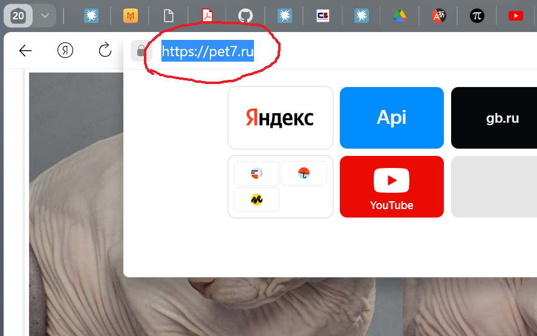
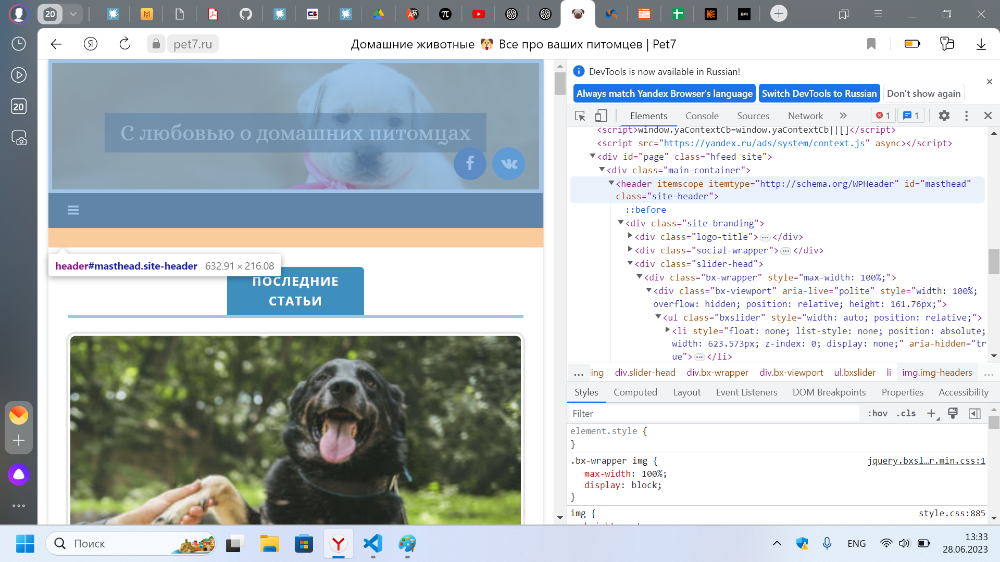
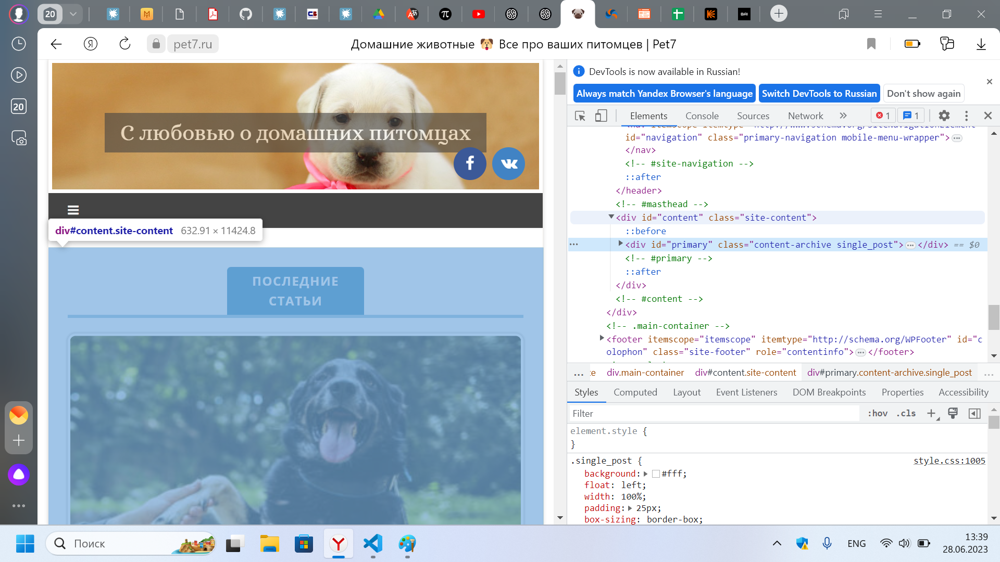
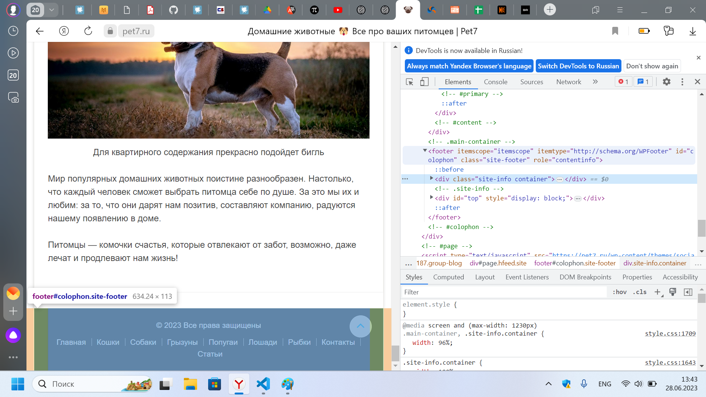
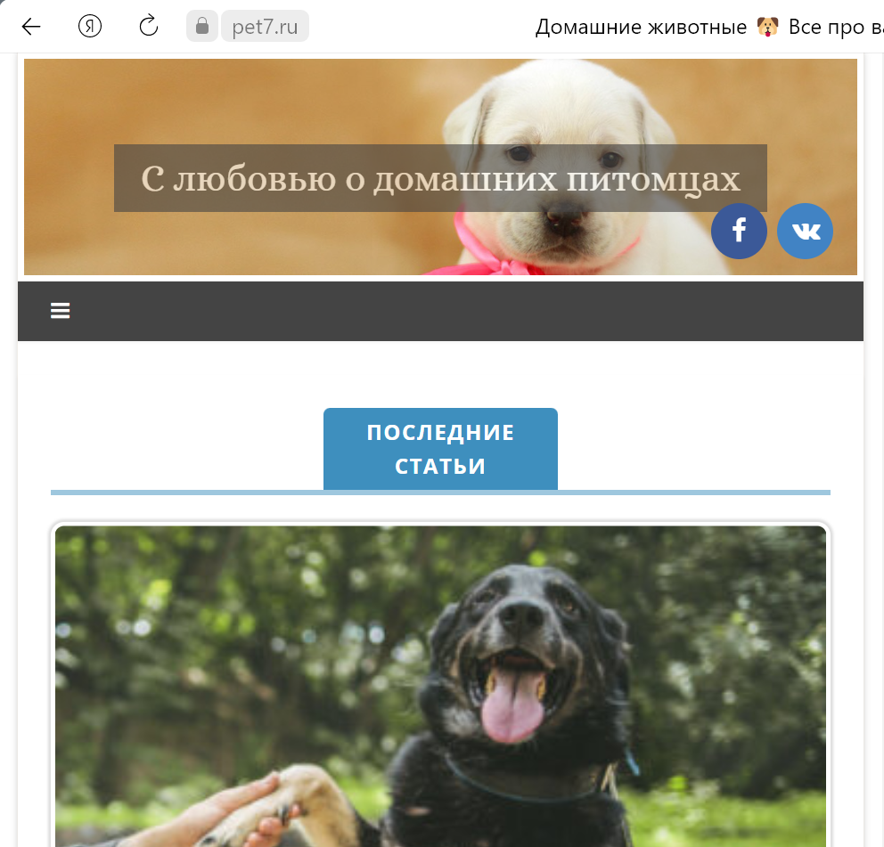
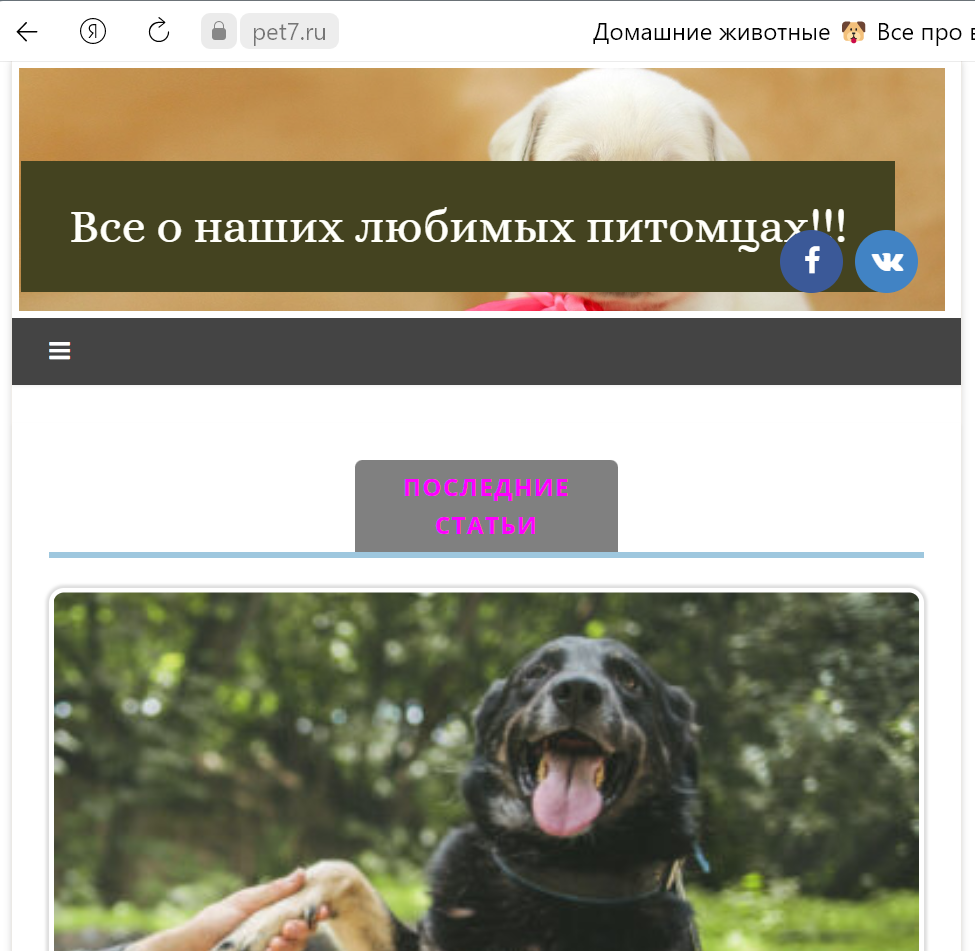
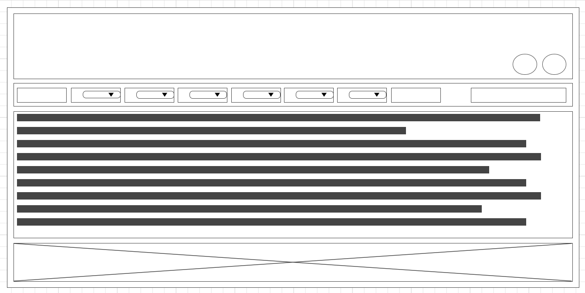

### Задача: на основе сайта https://pet7.ru/
- Определите, на каком протоколе работает сайт.
- Проанализируйте структуру страницы сайта.
- Внесите не менее 3 изменений на страницу с помощью инструмента разработчика и представьте скриншоты было/стало.
- Создайте прототип низкой детализации.

**1. Определите, на каком протоколе работает сайт.**

Сайт работает на протоколе HTTPS: 

**2. Проанализируйте структуру страницы сайта.**

Структура сайта:

`Шапка (header)` 
`Зона контента (content)` 
`Подвал (footer)` 

**3. Внесите не менее 3 изменений на страницу с помощью инструмента разработчика и представьте скриншоты было/стало.**

*Было:* 

*Стало:* 

**4. Создайте прототип низкой детализации.**

